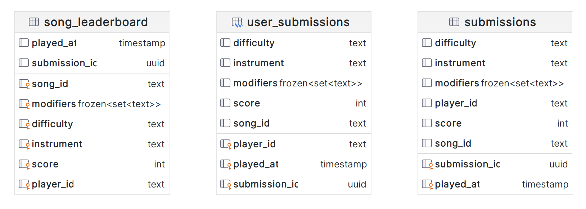

# Design and Data Model

You can learn more about Data Modeling in Scylla (and NoSQL) by taking
[this course](https://university.scylladb.com/courses/data-modeling/) on Scylla
University. The main goal of data modeling in Scylla is to perform queries fast,
even if we sometimes have to duplicate data.

Let's build our schema around the queries we are going to run against our domain
entities. When creating the data model, you need to consider both the conceptual
data model and the application workflow: which queries will be performed by
which users and how often.

To achieve that, we want:

-   Even data distribution
-   To minimize the number of partitions accessed in a read query.

On the other hand, our focus won't be on avoiding data duplication or minimizing
the number of writes. You're probably familiar with the steps defined here:


## Conceptual Data Model

Starting with the conceptual data model, we need to identify the key entities
and the relationships between them. Our application will be focused on three different entities, such as:

1. Song Submission - Whenever a user finish a gameplay and submit it to general submissions. 
2. Players Submissions - Store the latest gameplays and scores from a specific user.
3. Song Leaderboard - Leaderboard based on specific **song**, **instrument**, **difficulty** and **modifiers**.

The concept is to fill with many songs as we want. 



## Application Workflow

Next, we move on to the Application Workflow. In this part, we identify the main queries or what questions we will ask the database. This part is important in Scylla and other NoSQL databases and, as opposed to relational databases is performed early on in the data modeling process. Remember that our data modeling is built around the queries.

## Application Features

* Insert Submission
* Find a Submission
* List the Player's Last Submissions
* Song Leaderboard

## Queries

Now we can detail the above queries in
[CQL](https://university.scylladb.com/courses/data-modeling/lessons/basic-data-modeling-2/topic/cql-cqlsh-and-basic-cql-syntax/):

Q1: Create a Keyspace
```cql
CREATE KEYSPACE leaderboard
        WITH replication = {'class': 'NetworkTopologyStrategy', 'replication_factor': '3'} 
        AND durable_writes = true;
```
Q2: Create the 'Submissions' Table
```cql
CREATE TABLE IF NOT EXISTS leaderboard.submissions (
    submission_id uuid,
    song_id text,
    player_id text,
    modifiers frozen<set<text>>,
    score int,
    difficulty text,
    instrument text,
    played_at timestamp,
    PRIMARY KEY (submission_id, played_at)
);
```

Q3: Create the 'Leaderboard' Table
```cql
CREATE TABLE IF NOT EXISTS leaderboard.song_leaderboard (
    submission_id uuid,
    song_id text,
    player_id text,
    modifiers frozen<set<text>>,
    score int,
    difficulty text,
    instrument text,
    played_at timestamp,
    PRIMARY KEY ((song_id, modifiers, difficulty, instrument), score, player_id)
) WITH CLUSTERING ORDER BY (score DESC, player_id ASC);
```

Q4: Create the 'User Submission History' Materialized View
```cql
CREATE MATERIALIZED VIEW leaderboard.user_submissions AS
    SELECT *
    	FROM leaderboard.submissions
    	WHERE
			submission_id IS NOT null AND
			player_id IS NOT null AND
			played_at IS NOT null
    	PRIMARY KEY ((player_id), played_at, submission_id)
    WITH CLUSTERING ORDER BY (played_at DESC);
```

Q5: Insert new 'Submission' and 'Leaderboard'
```cql
INSERT INTO leaderboard.submissions (
    submission_id, song_id, player_id, modifiers, score, difficulty, instrument, played_at
) VALUES (
    b5ee3f80-40f9-4dfd-9fb6-13a6c94147a3, 'starlight-muse', 'daniel-reis', {'none'}, 1000, 'expert', 'guitar', '2023-11-23 00:00:00'
);

INSERT INTO leaderboard.song_leaderboard (
    submission_id, song_id, player_id, modifiers, score, difficulty, instrument, played_at
) VALUES (
    b5ee3f80-40f9-4dfd-9fb6-13a6c94147a3, 'starlight-muse', 'daniel-reis', {'none'}, 1000, 'expert', 'guitar', '2023-11-23 00:00:00'
);
```

<div class="admonition note">
    <p class="admonition-title">Note</p>
    <p>
        Since both tables have the same <strong>structure</strong>, the query will be same changing only the table name. For each new <strong>Submission</strong> the same data should be added to <strong>Leaderboard</strong>;
    </p>
</div>


Q6: Search a specific Submission
```cql
SELECT * FROM submissions WHERE submission_id = b5ee3f80-40f9-4dfd-9fb6-13a6c94147a3
```

Q7: Search a specific Song leaderboard
```cql
SELECT * FROM leaderboard.song_leaderboard  
WHERE 
    song_id = 'starlight-muse'
	AND modifiers = {'none'} 
	AND difficulty = 'expert' 
	AND instrument = 'guitar' 
	AND player_id = 'danielhe4rt' 
LIMIT 10;
```

Q8: Retrieve User Submission History

```cql
SELECT * FROM leaderboard.user_submissions WHERE 
    user_id = 'daniel-reis'
LIMIT 10;
```

Q9: Delete outdated leaderboard score from a user.

```cql
DELETE FROM leaderboard.song_leaderboard
WHERE 
    song_id = 'starlight-muse'
	AND modifiers = {'none'} 
	AND difficulty = 'expert' 
	AND instrument = 'guitar' 
	AND player_id = 'daniel-reis'
    AND score < 1000;
```

<div class="admonition note">
    <p class="admonition-title">Note</p>
    <p>
        If the user submit the same song with a higher score, you should delete the previous leaderboard entry and add the new one.
    </p>
</div>

## Helpful Material


Some more advanced topics not covered in this guide are
[Collections](https://university.scylladb.com/courses/data-modeling/lessons/advanced-data-modeling/topic/common-data-types-and-collections/),
User-Defined[Types](https://university.scylladb.com/courses/data-modeling/lessons/advanced-data-modeling/topic/user-defined-types-udt/)
(UDT), expiring data with [time to live (TTL)](https://university.scylladb.com/courses/data-modeling/lessons/advanced-data-modeling/topic/expiring-data-with-ttl-time-to-live/),
and [Counters](https://university.scylladb.com/courses/data-modeling/lessons/advanced-data-modeling/topic/counters/).

To summarize, when data modeling with Scylla, we have to know our data, think
about our queries, pay attention to the primary key and clustering key
selection, and not be afraid to duplicate data.

